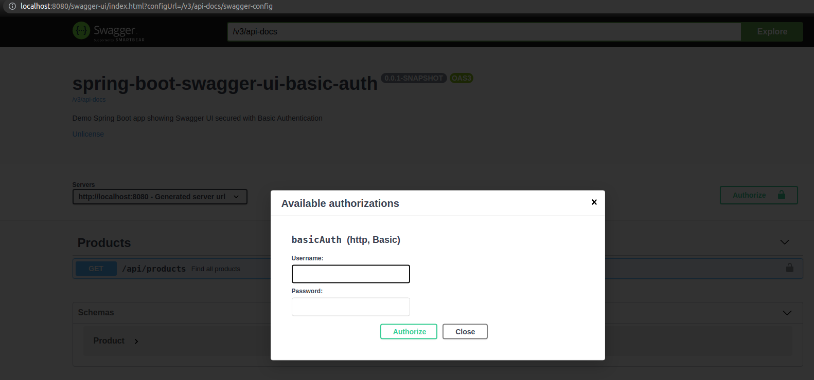

# spring-boot-swagger-ui-basic-auth

[](https://keepgrowing.in/)

## About this project

This Spring Boot project shows an example configuration of Spring Security and OpenAPI that ensures that only
authenticated users can call endpoints available through Swagger UI:



## Prerequisites
* JDK 13+
* [Maven](https://maven.apache.org/) (or you can use mvnw provided in the project)

## Getting started

First, [clone](https://docs.github.com/en/github/creating-cloning-and-archiving-repositories/cloning-a-repository-from-github/cloning-a-repository)
this repository.

Then, build it locally with:

```shell
mvn clean install
```

You can run the app in a command line with:

```shell
mvn spring-boot:run
```

### Visit API documentation

* Swagger UI: http://localhost:8080/swagger-ui.html
* OpenAPI specification: http://localhost:8080/v3/api-docs

### Default credentials

* username: `spring`
* password: `spring`

## Features

* Spring Security
* Basic Authentication in Swagger UI
* OpenAPI 3 specification

## Built With

* [Spring Boot v2.6+](https://spring.io/projects/spring-boot)
* [Maven](https://maven.apache.org/)
* [springdoc-openapi](https://springdoc.org/)
* [Dummy4j](https://daniel-frak.github.io/dummy4j/)
